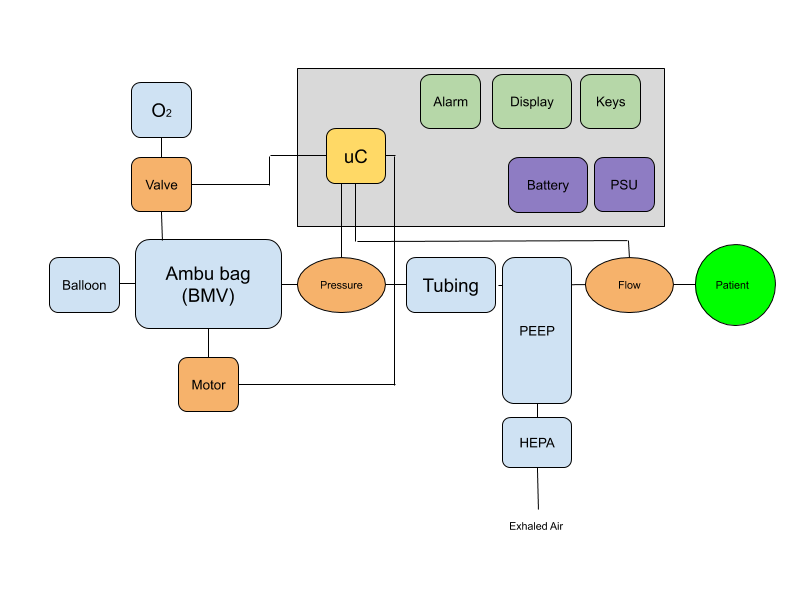
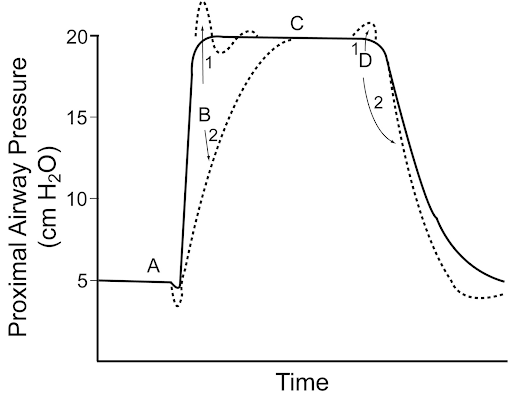
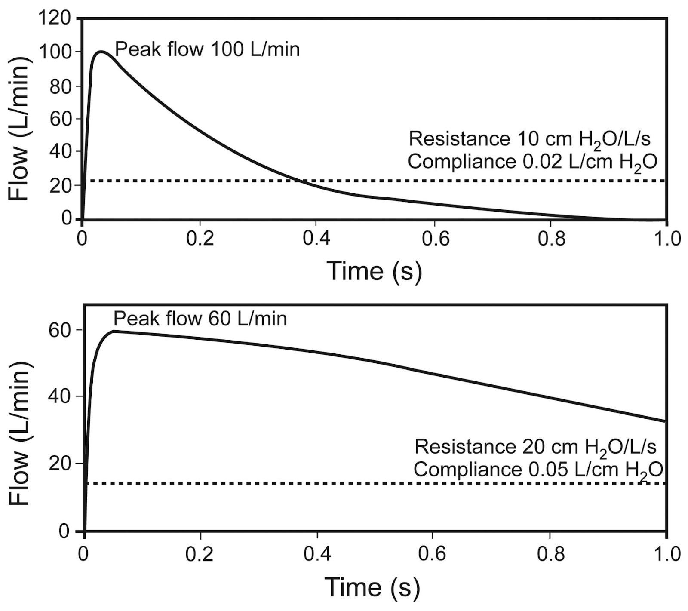

Edit this here: [https://docs.google.com/document/d/1h77FkKXqPOwVqfOj-PIJSjYX9QiEx69Av2gYuzqZolw/edit?usp=sharing](https://docs.google.com/document/d/1h77FkKXqPOwVqfOj-PIJSjYX9QiEx69Av2gYuzqZolw/edit?usp=sharing) \

## COVID-19 ARDS Ventilator

ARDS - acute respiratory distress syndrome

From https://www.propublica.org/article/a-medical-worker-describes--terrifying-lung-failure-from-covid19-even-in-his-young-patients

“It’s called acute respiratory distress syndrome, ARDS. That means the lungs are filled with fluid. And it’s notable for the way the X-ray looks: The entire lung is basically whited out from fluid. Patients with ARDS are extremely difficult to oxygenate. It has a really high mortality rate, about 40%. The way to manage it is to put a patient on a ventilator. The additional pressure helps the oxygen go into the bloodstream.”

“With our coronavirus patients, once they’re on ventilators, most need about the highest settings that we can do. About 90% oxygen, and 16 of PEEP, positive end-expiratory pressure, which keeps the lung inflated. This is nearly as high as I’ve ever seen. The level we’re at means we are running out of options.

“In my experience, this severity of ARDS is usually more typical of someone who has a near drowning experience — they have a bunch of dirty water in their lungs — or people who inhale caustic gas. Especially for it to have such an acute onset like that. I’ve never seen a microorganism or an infectious process cause such acute damage to the lungs so rapidly. That was what really shocked me.”

Medtronic (and others) design and build the ‘Ferrari’ of ventilators, OSVentilator Project intends on designing and building a ‘bicycle’

## Scope

Develop a low-cost, open source ventilator for emergency use to provide ventilation for COVID-19 ARDS patients that have no access to existing ventilators due to overwhelming demand on the medical system of any given country.

All mechanical elements ‘in the patient airway’ must be medically approved. Control electronics and software must be developed in line with existing medical device standards.

People **_will die_** if this device doesn’t operate correctly

All design documents - mechanical, electronic and software - will be made freely available via the Open-Source-Ventilator (OSV) project here: [https://gitlab.com/open-source-ventilator/OpenLung](https://gitlab.com/open-source-ventilator/OpenLung)

### Indication

The OSV device is indicated:

1. As an accessory to a bag valve mask
2. For patients in an acute emergency during complications of COVID-19
3. Patients will most commonly be experiencing acute respiratory distress (ARDs), they may or may not be spontaneously breathing and they are likely ventilator dependent.

### Environments of use 

AN OSV device can be used in three different environments. 

1. Acute Hospital Environment
2. Ambulatory scenario within the hospital
3. Transport situation (e.g. ambulance)

## Ventilator Specifications

Three common modes of control in Ventilators:

*   Volume Control
*   Pressure Control
*   Pressure Regulated Volume Control (PRVC)

Minute Ventilation (MV) = Tidal Volume (VT) x Respiratory Rate (RR)

MV = amount of air a patient moves in a minute 

MV can be 5 - 10 lpm in a normal patient but can be 30lpm in a sick patient

FS02 - Flow source O2. The flow from the supply.

FDO2 - Flow delivered O2. The flow of O2 at the patient mask.

FiO2 - Flow (inspired) O2. The O2 in the patient.

    Fig. 1: System overview

These appear to be the accepted ranges for treating Convid-19 ARDS - from UCC’s ARDS Ventilatory Management PDF:

<table>
  <tr>
   <td><strong>Variable</strong>
   </td>
   <td><strong>Range</strong>
   </td>
   <td><strong>Accuracy</strong>
   </td>
   <td><strong>Settings</strong>
   </td>
   <td><strong>Default</strong>
   </td>
   <td><strong>Notes</strong>
   </td>
  </tr>
  <tr>
   <td><strong>Tidal Volume (VT)</strong>
   </td>
   <td>4-6ml/Kg IBW*

(205 - 530ml)
   </td>
   <td>±???
   </td>
   <td>±1ml/Kg

(35ml)
   </td>
   <td>-
   </td>
   <td>
   </td>
  </tr>
  <tr>
   <td><strong>Respiratory rate (RR)</strong>
   </td>
   <td>15-35bpm
   </td>
   <td>???
   </td>
   <td>±2bpm
   </td>
   <td>15bpm
   </td>
   <td>
   </td>
  </tr>
  <tr>
   <td><strong>I:E Ratio</strong>
   </td>
   <td>1:1 - 1:5
   </td>
   <td>???
   </td>
   <td>???
   </td>
   <td>
   </td>
   <td>
   </td>
  </tr>
  <tr>
   <td><strong>Plateau Airway Pressure (PAW)</strong>
   </td>
   <td>10-30cmH2O
   </td>
   <td>???
   </td>
   <td>???
   </td>
   <td>&lt; 30cmH2O
   </td>
   <td>If > 35 VT needs to be decreased to 5 or 4ml/Kg IBW
   </td>
  </tr>
  <tr>
   <td><strong>Driving Pressure</strong>

<strong>(PAW-PEEP)</strong>
   </td>
   <td>???-15cmH2O
   </td>
   <td>???
   </td>
   <td>???
   </td>
   <td>
   </td>
   <td>
   </td>
  </tr>
  <tr>
   <td><strong>PEEP</strong>
   </td>
   <td>5-16cmH2O
   </td>
   <td>???
   </td>
   <td>±1
   </td>
   <td>???
   </td>
   <td>Does this need to be controlled and set remotely or can it be done manually?
   </td>
  </tr>
</table>

(*)Calculate Ideal Body Weight (IBW, Kg) using patient height (cm):

<table>
  <tr>
   <td><strong>Male</strong>
   </td>
   <td><strong>Female</strong>
   </td>
  </tr>
  <tr>
   <td>= 50+0.91x(height in cm-152.4)
   </td>
   <td>= 45.5+0.91x(height in cm-152.4)
   </td>
  </tr>
</table>

### Humidification

Out of scope. This could be considered a ‘comfort feature’ for long-term use.

### Nebulizer

Nebulizers are used to deliver inhaled prostacyclin analogues in patients with severe ARDS and refractory hypoxemia. See ISO/AWI 27427 for connector specs.

### Mask or Tubing???

Depends on patient’s clinical condition.  Non-invasive mask or helmet ventilation is typically used if the patient is alert, reasonably stable and the main problem is severe hypoxemia and the lungs are not too stiff.  Endotracheal intubation is generally required if the patient is too agitated to wear mask, is exhausted, has decreased level of consciousness or is profoundly hypoxemic (low level of oxygen in arterial blood).

From [http://rc.rcjournal.com/content/56/1/52](http://rc.rcjournal.com/content/56/1/52)

### Cycling of the Mechanical Ventilator Breath

The change from inspiration to expiration is a crucial point in the mechanically ventilated breath, and is termed "cycling".

Cycling Mechanisms:

*   Pressure (PMAX - I’m using this for want of a better term ~ there may be a standard term used here)
    *   When a set pressure is reached, inspiration is cycled into exhalation. Most commonly used during alarm - if a patient becomes extremely asynchronous (in their breathing) or coughs, a high-pressure alarm may be triggered and the inspiration phase will end.
*   Time (TCY)
    *   Switch from inspiration to exhalation when a set time period is reached. This can be achieved by setting the **_Resp Rate, Inspiratory Time or I:E Ratio_**. _Many ventilators terminate the inspiratory phase after 3-5secs._
*   Volume (VT & VTMAX)
    *   Inspiration stops once VT is reached. Cycling to exhalation phase will occur when VT OR VTMAX is reached.
*   Flow (FCY)
    *   During pressure-support ventilation (PSV), the patient both triggers and cycles the breath. (See diagram below) When a patient's inspiratory flow decreases to 25% of  peak inspiratory flow, the breath would cycle to the exhalation phase.

    Fig. 2: Characteristics of a pressure-supported breath. In this example, the baseline pressure (ie, PEEP) is set at 5 cm H2O, and the pressure support is set at 15 cm H2O. The inspiratory pressure is triggered at point A by a patient effort, resulting in an airway pressure decrease. The rise to pressure (line B) is provided by the initial flow into the airway. If the initial flow is excessive, the initial pressure exceeds the set level (B1). If the initial flow is low, there is a slow rise to pressure (B2). The plateau of pressure support (line C) is maintained by control of flow. A smooth plateau indicates appropriate flow responsiveness to patient demand. Termination of pressure support occurs at point D and should coincide with the end of neural inspiration. If breath termination is delayed, the patient may actively exhale (the pressure rises above the plateau) (D1). If breath termination is premature, the patient may have continued inspiratory efforts (D2). (Adapted from Reference 18, with permission.)

    Fig. 3: Effect of respiratory mechanics on cycling of pressure support from inhalation to exhalation. Flow cycling is set at 25% of the peak flow, as illustrated by the broken line. The upper panel represents the respiratory mechanics of a patient with restrictive lung disease. The lower panel represents the respiratory mechanics of a patient with obstructive lung disease. In each case the neural inspiratory time is 1.0 second. The breath terminates prematurely in the patient with restrictive lung disease, but the breath is prolonged in the patient with obstructive lung disease. Also note that the peak flow is greater in restrictive lung disease, and the pressure decrease is more rapid in restrictive lung disease. (Adapted from Reference 19.)

### Alarms
1. There must be a visual display of an alarm situation. This must be visible from XXm.
2. There must be an audio alarm, with continuous sound of YYdB.
3. Alarms may be silenced, for a period of ZZ seconds, via the user interface. 
4. If the underlying alarm condition has not been cleared, the alarm will sound again.

There are 3 types of alarms:

1. Input - power supply and air / oxygen source
2. Control - incorrect settings of control variables
3. Output - incorrect outputs from the Ventilator to the patient

<table>
  <tr>
   <td>
<strong>Alarm type</strong>
   </td>
   <td><strong>Min</strong>
   </td>
   <td><strong>Max</strong>
   </td>
  </tr>
  <tr>
   <td><strong>Minute Ventilation (MV)</strong>
   </td>
   <td>&lt;5lpm
   </td>
   <td>>30lpm
   </td>
  </tr>
  <tr>
   <td><strong>Peek Pressure</strong>
   </td>
   <td>
   </td>
   <td>>??
   </td>
  </tr>
  <tr>
   <td><strong>Tidal Volume (VT)</strong>
   </td>
   <td>&lt;200ml
   </td>
   <td>>600ml ???
   </td>
  </tr>
  <tr>
   <td><strong>Flow</strong>
   </td>
   <td>??
   </td>
   <td>??
   </td>
  </tr>
  <tr>
   <td><strong>Inspired Gas Temp</strong>
   </td>
   <td>??℃
   </td>
   <td>??℃
   </td>
  </tr>
  <tr>
   <td><strong>O2 Concentration</strong>
   </td>
   <td>??%
   </td>
   <td>??%
   </td>
  </tr>
  <tr>
   <td><strong>Input Power</strong>
   </td>
   <td>
   </td>
   <td>
   </td>
  </tr>
  <tr>
   <td><strong>Battery SOC</strong>
   </td>
   <td>&lt;50%??
   </td>
   <td>Reset alarm >90%SOC
   </td>
  </tr>
  <tr>
   <td><strong>Failed Self Test</strong>
   </td>
   <td>
   </td>
   <td>
   </td>
  </tr>
  <tr>
   <td>
   </td>
   <td>
   </td>
   <td>
   </td>
  </tr>
</table>

Are there Alarm standards?

### Sensors & Control Valves

*   PEEP - Adjustable between 5-16cmH2O. Need to source a PEEP valve.
*   SpO2 - can we get this from an external, existing hospital sensor?
*   FSO2 / FDO2 / FiO2??? - O2 sensors? Need medical ones?
*   O2 flow - valve???
*   Flow - Sensirion SFM3300 or similar (I2C interface)
*   Pressure - ??? Can we measure this outside of the ‘patient airway’?

Accuracy???

### Power Supply

Mains power. Medical grade PSU ideally operating on universal input - 90V - 240V AC, 50 - 60Hz, with an output of XX V DC, @ YY Amps.

Battery backup. ?? V, ?? Ah battery providing power to the entire system for 60 mins. Battery should recharge once mains power is returned. Battery should recharge to 100% SOC within YY mins.

### User Interface

    What must be displayed? 

    What is the minimum? 

    What’s nice to have?

    Method of interacting with display. Buttons or rotary encoder.

### Self Tests

    Battery. Test battery is operational and can power the entire device.

    Sensors. Perform built-in self test on all sensors.

    Motors. Ensure motors are operational and moving within set limits.

    Microcontroller. Tests?

### Safety

    Fire? Wiring?

    Fail-safe - motors? Valves fail open/closed?

HEPA filters

### Mechanical

    Widely available materials

    Easy clean surfaces that are not affected by hospital cleaning products??

### Cost

    Bill of Materials &lt; $YYY or €XXX

### Ventilator Standards

Standards relating to ventilator use, operations and design

*   ASTM F 1100-90 (Standard Specifications for Ventilators Intended for Use in Critical Care) (Withdrawn without replacement in 2004)
*   ASTM F 1246-91 (Standard Specification for Electrically Powered Home Care Ventilators, Part 1-Positive-Pressure Ventilators and Ventilator Circuits) ([LINK](https://civilengineersstandard.com/wp-content/uploads/2019/02/F-1246.pdf))
*   IEC 6061-2-12(Standard for Critical Care Ventilators)
*   ISO 80601-2-12:2020 Medical electrical equipment — Part 2-12: Particular requirements for basic safety and essential performance of critical care ventilators
*   ICS 11.040.10 (ANAESTHETIC, RESPIRATORY AND REANIMATION EQUIPMENT INCLUDING MEDICAL GAS INSTALLATIONS)
*   ISO 10651-3:1997 (Lung ventilators for medical use — Part 3: Particular requirements for emergency and transport ventilators)
*   ISO 10651-4:2002 (Lung ventilators — Part 4: Particular requirements for operator-powered resuscitators)
*   ISO 10651-5:2006 (Lung ventilators for medical use — Particular requirements for basic safety and essential performance — Part 5: Gas-powered emergency resuscitators)
*   ISO 19223:2019 (Lung ventilators and related equipment — Vocabulary and semantics)
*   ISO/TR 21954:2018 (Guidance on the selection of the appropriate means of ventilation based on the intended patient, use environment, and operator)
*   ISO 80601-2-72:2015
*   Medical electrical equipment — Part 2-72: Particular requirements for basic safety and essential performance of home healthcare environment ventilators for ventilator-dependent patients
*   ISO 80601-2-79:2018
*   Medical electrical equipment — Part 2-79: Particular requirements for basic safety and essential performance of ventilatory support equipment for ventilatory impairment
*   ISO 80601-2-80:2018
*   Medical electrical equipment — Part 2-80: Particular requirements for basic safety and essential performance of ventilatory support equipment for ventilatory insufficiency
*   ISO/DIS 80601-2-87 (Medical electrical equipment — Part 2-87: Particular requirements for basic safety and essential performance of high-frequency ventilators)
*   ISO/FDIS 80601-2-84 (Medical electrical equipment — Part 2-84: Particular requirements for basic safety and essential performance of ventilators for the emergency medical services environment)
*   BSEN 794-3:1998 +A2:2009 Particular requirements for emergency and transport ventilators

### Connectors for Respiratory Devices

ISO/AWI 27427 Nebulizing systems and components (Under Development)

ISO/AWI TR 22175 Connectors for respiratory devices (Under Development)

### References

*   Design Requirements
*   [University College Cork Covid-19 Resource Centre](https://ucc.instructure.com/courses/22984)
*   [UCC Covid-19 Critical Care](https://ucc.instructure.com/courses/22984/pages/critical-care)
*   [UCC Covid-19 induced ARDS - protective lung ventilation (Meeke 2020)](https://ucc.instructure.com/courses/22984/files/1700272/download?wrap=1)
*   [The Center for Safety, Simulation and Advanced Learning Technologies](https://simulation.health.ufl.edu/technology-development/open-source-ventilator-project/)
*   [CSSALTlab Open Source Ventilator - Github repo](https://github.com/CSSALTlab/Open_Source_Ventilator)
*   [Pressure Regulated Volume Control (PRVC): Set it and forget it?](https://www.sciencedirect.com/science/article/pii/S2213007118303757)
*   [Cycling of the Mechanical Ventilator Breath](http://rc.rcjournal.com/content/56/1/52)
*   [https://youtu.be/-ksxZeKpbjw](https://youtu.be/-ksxZeKpbjw)
*   https://my.clevelandclinic.org/-/scassets/files/org/respiratory/fundamentals-of-mechanical-ventilation.ashx?la=en&fbclid=IwAR0CA5Bnv8oVnQriB47-NYzJuLUHX2M3m2jY4KvQ-zFPjmExGzFwvSLvnHg
